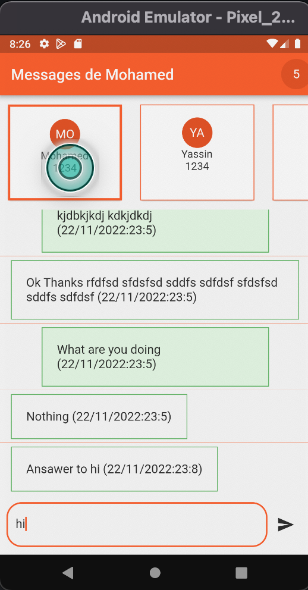
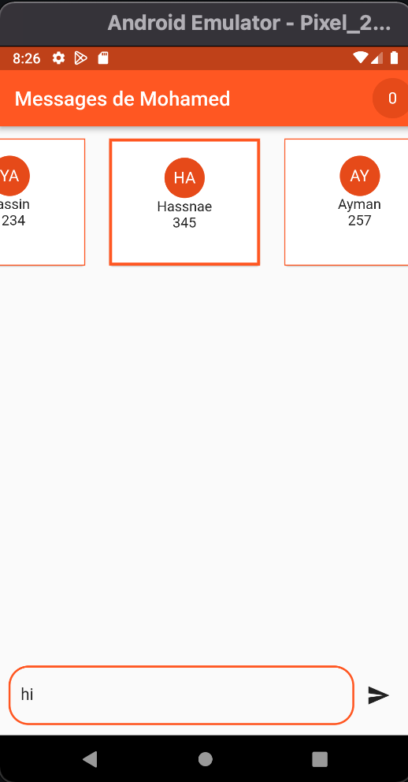

# contacts_bloc_app

A new Flutter project.

## Getting Started

In This project, we used Bloc's concept for dispatching the data that exist in the repository. and across this application, we take many things like how we use to create an application that we separate the business logic and UI logic. we separated the different parts (bloc, repository, model, UI...), and we saw how to build a page by different widgets. Generally, we respected the best practice to build a mobile application cross-plateform flutter

## Capture

